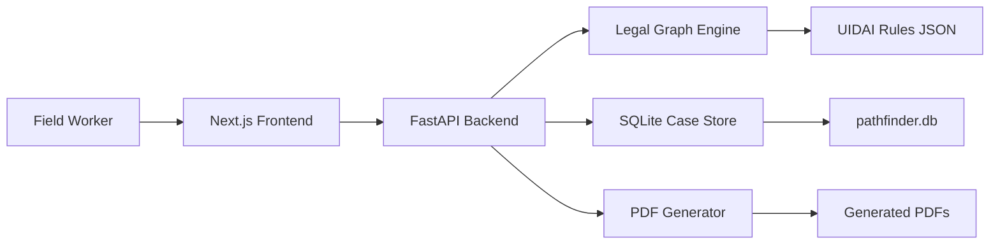

# PathFinder

## AI-Powered Legal Documentation Navigator for Aadhaar Inclusion

PathFinder is a full-stack hackathon prototype that helps frontline workers discover practical, rule-backed Aadhaar enrollment pathways for people who do not have standard identity or address documents.

It is built for ASHA workers, government school teachers, NGO caseworkers, legal aid volunteers, and local administrators who support vulnerable residents through documentation barriers. A worker enters a person's situation, existing documents, local witnesses, and enrollment problem. PathFinder then recommends a legal route, explains the reasoning, flags risks, stores the case, and generates submission-ready PDF documents.

## The Problem

Many residents who most need public services are also the least likely to have complete documentation. Aadhaar enrollment can become difficult for people who are:

- Homeless or displaced.
- Migrant workers.
- Children or young adults with limited records.
- People without identity proof or address proof.
- People without a Head of Family link.
- People facing biometric enrollment issues.
- People who are known locally but lack formal paperwork.

Frontline workers often know the person and the local facts, but they may not know which legal pathway is most suitable, what documents to prepare, or how to explain the case at an enrollment center.

## Our Solution

PathFinder turns fragmented procedural knowledge into a guided workflow.

The system combines a legal knowledge base, weighted graph search, case storage, analytics, and PDF generation to help field workers move from intake to action.

With PathFinder, a worker can:

- Capture a person's documentation situation.
- Identify available institutional or community witnesses.
- Generate a recommended Aadhaar enrollment pathway.
- See confidence, timeline, legal reasoning, regional notes, and risks.
- Compare alternative legal paths.
- Generate cover letters, affidavits, declarations, and verification letters.
- Store and revisit cases.
- Export case JSON or print a case summary.

## Demo Flow

1. Open the dashboard.
2. Review existing seeded cases and analytics.
3. Create a new case.
4. Enter personal details, location, available documents, and known witnesses.
5. Select the current Aadhaar enrollment blockage.
6. Generate a legal pathway.
7. Review confidence, reasoning, risks, alternatives, and required documents.
8. Generate PDFs for the required documents.
9. Download, print, or export the case.

## Key Features

### Legal Path Recommendation

- Uses a NetworkX directed graph to model evidence and enrollment pathways.
- Chooses weighted shortest paths based on confidence scores.
- Considers location, problem type, available documents, and local witnesses.
- Produces recommended and alternative paths.

### Explainable Output

- Shows step-by-step legal reasoning.
- Provides confidence score and expected timeline.
- Highlights risk indicators for weak cases.
- Includes regional notes where rules may vary.

### Case Management

- Saves cases to a local SQLite database.
- Generates unique PathFinder case IDs.
- Supports dashboard search by case ID, name, and district.
- Tracks generated documents for each case.

### PDF Generation

- Generates working PDF documents with ReportLab.
- Supports cover letters, affidavits, verification letters, and introducer declarations.
- Includes case details, legal reasoning, references, and signature blocks.

### Dashboard Analytics

- Shows total cases.
- Shows average confidence.
- Shows legal graph size.
- Shows rules loaded.
- Displays cases by district.
- Displays common problem types.
- Shows most used legal path.

### Frontend Experience

- Responsive Next.js dashboard.
- Three-step new case workflow.
- Case detail page with legal route visualization.
- Dark mode support.
- JSON export.
- Print support.

## Tech Stack

### Frontend

- Next.js
- React
- TypeScript
- Tailwind CSS
- Lucide React icons
- Local shadcn-style UI components

### Backend

- Python
- FastAPI
- Pydantic
- NetworkX
- SQLite
- ReportLab
- Uvicorn

### Data And Generated Assets

- Legal rules: `knowledge/uidai_rules.json`
- SQLite database: `database/pathfinder.db`
- Generated PDFs: `pdfs/`

## Architecture



## How The Recommendation Engine Works

PathFinder stores legal and procedural pathways as graph edges. Each edge has:

- Source node.
- Target node.
- Legal basis.
- Confidence score.
- Estimated days.
- Regional notes.
- Rule metadata.

Example pathway:

```text
ASHA -> Community Affidavit -> Introducer -> Aadhaar
```

When a case is submitted, the engine:

1. Builds candidate starting points from available evidence and witnesses.
2. Searches for paths to the Aadhaar target node.
3. Scores paths using weighted confidence.
4. Adjusts notes for state-specific rule applicability.
5. Selects the best path.
6. Returns legal reasoning, required documents, risks, and alternatives.

This makes the recommendation explainable instead of opaque.

## Project Structure

```text
.
├── backend/
│   ├── main.py                  FastAPI app and API routes
│   └── app/
│       ├── database.py          SQLite persistence and analytics
│       ├── graph_engine.py      Legal path recommendation engine
│       ├── knowledge.py         Rule loading
│       ├── models.py            Pydantic request and response models
│       ├── pdf_generator.py     PDF document generation
│       └── seed.py              Demo case seeding
├── frontend/
│   ├── app/
│   │   ├── page.tsx             Dashboard
│   │   ├── layout.tsx           App shell and navigation
│   │   └── cases/
│   │       ├── new/page.tsx     New case workflow
│   │       └── [id]/page.tsx    Case detail and documents
│   ├── components/              UI components
│   └── lib/
│       ├── api.ts               Frontend API client
│       └── types.ts             TypeScript types
├── knowledge/
│   └── uidai_rules.json         Legal pathway knowledge base
├── database/
│   └── pathfinder.db            Local SQLite database
├── pdfs/                        Generated PDF documents
├── requirements.txt             Python dependencies
├── package.json                 Root frontend command shortcuts
└── README.md
```

## Getting Started

### Prerequisites

- Python 3.11 or later recommended.
- Node.js 18 or later recommended.
- npm.

### 1. Install Backend Dependencies

```bash
pip install -r requirements.txt
```

### 2. Install Frontend Dependencies

```bash
cd frontend
npm install
```

### 3. Run The Backend

From the project root:

```bash
cd backend
uvicorn main:app --reload
```

Backend runs at:

```text
http://127.0.0.1:8000
```

Health check:

```text
http://127.0.0.1:8000/health
```

### 4. Run The Frontend

In a second terminal:

```bash
cd frontend
npm run dev
```

Frontend runs at:

```text
http://localhost:3000
```

## Environment Configuration

The frontend reads the backend URL from:

```text
NEXT_PUBLIC_API_URL
```

Default:

```text
http://127.0.0.1:8000
```

Example:

```bash
NEXT_PUBLIC_API_URL=http://127.0.0.1:8000 npm run dev
```

## API Reference

### Health

```http
GET /health
```

Returns backend status.

### Rules

```http
GET /rules
```

Returns configured legal pathway rules.

### Stats

```http
GET /stats
```

Returns legal graph statistics and dashboard analytics.

### Generate Path

```http
POST /generate-path
```

Generates a recommendation without storing a case.

### Create Case

```http
POST /cases
```

Creates a case, generates its recommended path, and saves it.

### List Cases

```http
GET /cases
GET /cases?search=<term>
```

Lists saved cases, optionally filtered by case ID, person name, or district.

### Get Case

```http
GET /cases/{case_id}
```

Returns one saved case.

### Generate PDF

```http
POST /generate-pdf
```

Generates a required PDF document for a saved case.

### Download PDF

```http
GET /pdfs/{filename}
```

Downloads a generated PDF.

## Sample Use Case

A migrant worker in Delhi has no address proof but is known by an employer and a neighbour.

PathFinder may recommend:

```text
Employer -> Employer Certificate -> Address Proof -> Aadhaar
```

It can also show alternative routes such as:

```text
Neighbour -> Community Affidavit -> Address Proof -> Aadhaar
```

The system then identifies required documents such as:

- Cover Letter to Enrollment Officer.
- Employer Verification Letter.
- Community Affidavit, if the selected path uses community evidence.

## What Makes This Useful

PathFinder is designed around real field constraints:

- Workers need fast decisions, not long legal manuals.
- Residents may have partial evidence instead of standard documents.
- Enrollment paths need to be explainable to officials.
- Generated documents must be usable offline or in person.
- Cases need to be tracked over time.

The project does not replace legal judgment. It helps workers prepare better cases and make inclusion pathways easier to understand.

## Current Status

PathFinder is a working local prototype suitable for a hackathon demo.

Implemented:

- Full-stack local app.
- Dashboard and analytics.
- Case intake workflow.
- Legal path generation.
- SQLite case persistence.
- Seeded demo data.
- PDF document generation.
- Case print and JSON export.

Not production-ready yet:

- Legal references need final verification.
- Authentication is not implemented.
- Sensitive data encryption is not implemented.
- Offline sync is not implemented.
- Rule review workflow is not implemented.

## Validation

Frontend production build:

```bash
cd frontend
npm run build
```

Backend smoke checks:

```bash
curl http://127.0.0.1:8000/health
curl http://127.0.0.1:8000/stats
```

## Roadmap

### Legal And Policy Accuracy

- Replace placeholder circular references with verified UIDAI circular numbers and official links.
- Add rule versioning and review status.
- Track source validity dates.
- Add jurisdiction-specific rule variations.

### Product Experience

- Add stronger form validation.
- Add autosave for case intake.
- Add multilingual UI labels.
- Add multilingual PDF templates.
- Add better empty, loading, and error states.
- Add filters by district, problem, confidence, and outcome.

### Field Readiness

- Add offline-first case capture.
- Add sync when internet is available.
- Add printable blank intake forms.
- Add low-bandwidth mode.
- Add mobile-first refinements for field devices.

### Security And Governance

- Add authentication and role-based access.
- Encrypt sensitive case data at rest.
- Add audit logs.
- Add consent capture.
- Add organization-level data separation.

### Engineering

- Add backend unit tests.
- Add frontend component tests.
- Add database migrations.
- Add Docker setup.
- Add deployment documentation.

## Team Submission Notes

This project demonstrates a complete civic-tech workflow:

- Problem discovery: documentation exclusion in Aadhaar enrollment.
- Decision support: graph-based legal pathway recommendation.
- Case operations: intake, storage, search, and analytics.
- Action output: generated PDFs that can be taken to an enrollment center.
- Explainability: legal reasoning and risk indicators for each recommendation.

The strongest demo path is:

1. Show the dashboard.
2. Create a difficult case with no standard documents.
3. Mark a community or institutional witness.
4. Generate the legal path.
5. Explain confidence and risk indicators.
6. Generate a PDF document.
7. Open the PDF as the final field-ready output.

## Disclaimer

PathFinder is a hackathon prototype. The rule base is simplified and includes placeholder references that must be verified before real-world use. The system is intended to assist trained workers and legal aid teams, not to provide final legal advice or guarantee Aadhaar enrollment approval.

